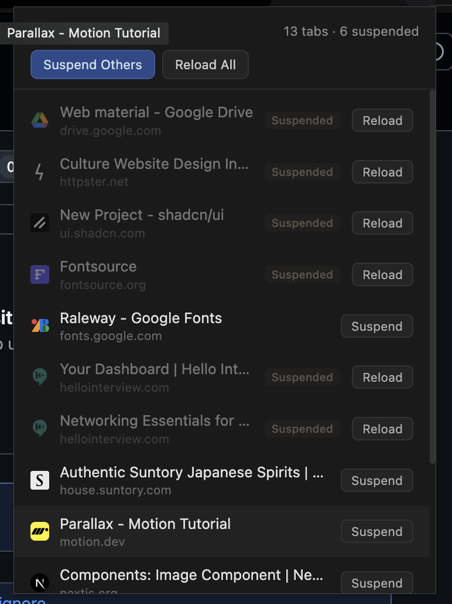

# Tab Suspender

A minimal Chrome/Brave browser extension (Manifest V3) for manually suspending tabs to free up memory without closing them.



▶️ [Watch the demo video](https://youtu.be/gndLvlQxoVs)

## Features

- **Suspend individual tabs** — discard any inactive tab from the popup list
- **Suspend Others** — one-click discard of all non-active, non-pinned, non-audible tabs
- **Reload All** — restore every suspended tab in the current window
- **Live tab list** — shows titles, hostnames, favicons, and status badges (Active / Suspended / Pinned / Playing)
- **Click to switch** — click any tab row to jump to it

## Install (unpacked)

1. Clone this repository:

   ```bash
   git clone https://github.com/Tseku210/tab-suspender.git
   ```

2. Open `chrome://extensions` (or `brave://extensions`)
3. Enable **Developer mode**
4. Click **Load unpacked** and select the cloned folder

## Files

- `manifest.json` — extension manifest (MV3)
- `popup.html` / `popup.js` — popup UI and tab management logic
- `icons/` — extension icons
